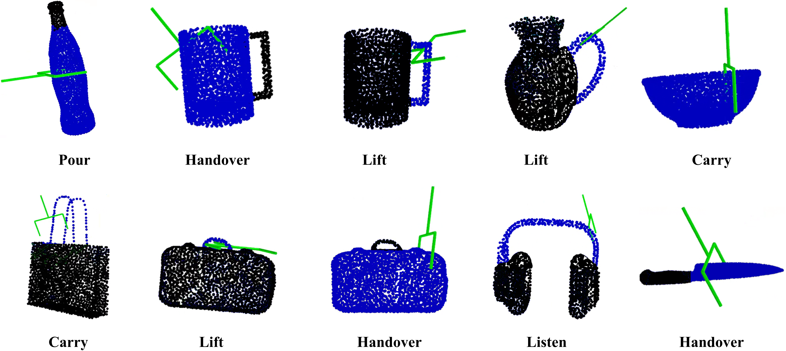

<div align="center">

# AGPENet: Affordance-Guided 6-DoF Grasp Pose Estimation

### 3D implementation for

**Spatially Grounded Affordance Conditioning for Instruction-Guided 6-DoF Grasping**

</div>

## Overview

This repository contains the implementation of the **3D affordance re-grounding and 6-DoF grasp pose generation module**, referred to as **AGPENet**, in our paper:

> **Spatially Grounded Affordance Conditioning for Instruction-Guided 6-DoF Grasping**


## 1. Installation

We recommend creating a dedicated Conda environment:

```bash
conda create -n affpose python=3.8
conda activate affpose

conda install pip
pip install -r requirements.txt
```

---

## 2. Dataset

The dataset used for 3D affordance grounding and 6-DoF grasp pose estimation can be downloaded from:

[Download the 3D dataset](https://drive.google.com/drive/folders/1vDGHs3QZmmF2rGluGlqBIyCp8sPR4Yws?usp=sharing)

The processed data contain point-cloud samples together with the corresponding affordance conditions, point-level affordance annotations, and compatible 6-DoF grasp poses.

Before training, download the dataset and specify the corresponding data path in the configuration file.

---

## 3. Training

The current implementation supports single-GPU training.

The default training configuration is provided in:

```text
config/detectiondiffusion.py
```

Before training, modify the dataset path in the configuration file:

```python
data_path = "<path-to-your-downloaded-data>"
```

Other training and model hyperparameters can also be adjusted in the configuration file when needed.

Start training with:

```bash
python3 train.py --config ./config/detectiondiffusion.py
```

The training pipeline jointly optimizes:

* point-level affordance prediction for semantic re-grounding, and
* diffusion-based 6-DoF grasp pose generation.

---

## 4. Testing

To evaluate a trained checkpoint, run:

```bash
python3 detect.py \
    --config <your-configuration-file> \
    --checkpoint <your-trained-model-checkpoint> \
    --test_data <your-test-data>
```

The predicted affordance regions and generated grasp poses will be saved to:

```text
result.pkl
```

For the quantitative evaluation reported in the paper, we evaluate **200 generated poses for each affordance-object pair**, following the 3DAP evaluation protocol.

The classifier-free guidance scale used in our reported experiments is:

```text
0.2
```

The pose sampling budget and guidance scale can be modified through the corresponding configuration or inference settings when required.

---

## 5. Visualization

To visualize the predicted affordance regions and generated 6-DoF grasp poses, run:

```bash
python3 visualize.py --result_file <your-result-pickle-file>
```

An example visualization is shown below:

<div align="center">



</div>

The visualization displays the predicted task-relevant regions on the object point cloud together with the generated grasp candidates.

---

## 6. Acknowledgements

This repository is built primarily upon the following open-source projects:

* [3DAPNet: Language-Conditioned Affordance-Pose Detection in 3D Point Clouds](https://github.com/Fsoft-AIC/Language-Conditioned-Affordance-Pose-Detection-in-3D-Point-Clouds)
* [3D AffordanceNet](https://github.com/Gorilla-Lab-SCUT/AffordanceNet)

We sincerely thank the authors for releasing their code and datasets.

In particular, the overall code structure for language-conditioned affordance prediction and diffusion-based grasp pose generation is derived from **3DAPNet**, on top of which we implement the AGPENet modifications described in our paper.

